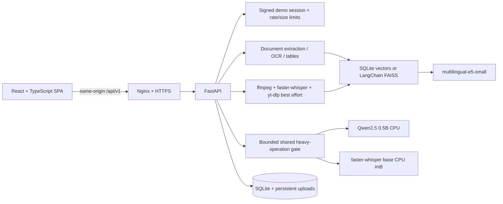
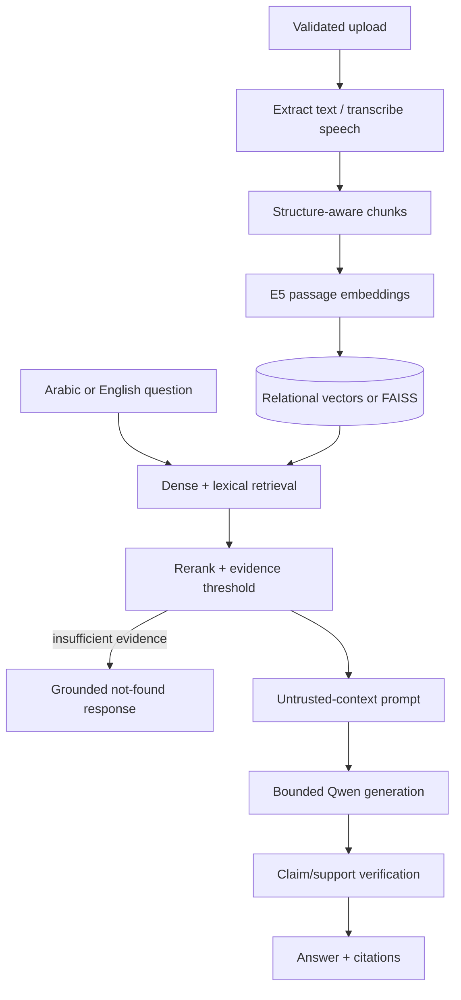

# EnterpriseRAG

EnterpriseRAG is a local-first, multilingual retrieval-augmented generation platform for
grounded questions, citations, document intelligence, and audio/video transcription. It
combines a React + TypeScript workspace with FastAPI, SQLite, Hugging Face models, a custom
hybrid retriever, an optional LangChain/LCEL path, and a CPU-safe media pipeline.

> Public demo URL: **add the production HTTPS URL after DNS and certificate validation**.
>
> Public demo warning: do not upload confidential, personal, regulated, or sensitive
> information. Demo files may be deleted automatically. AI output may contain errors;
> inspect the cited sources. YouTube import is best-effort, while direct MP3/MP4 upload is
> the supported reliable media path.

## Screenshots

Add current release screenshots after the production browser checklist passes:

- Landing page — desktop, 1440 × 1000
- Landing page — mobile, 390 × 844
- Arabic grounded answer with citation — 1440 × 1000
- Direct media transcript and timestamp citation — 1440 × 1000
- Operations/settings limits — 1440 × 1000

Existing measured development artifacts are under [`artifacts/`](artifacts/); no screenshot
in this section should be treated as current until manually reviewed.

## Capabilities

- PDF, DOCX, and UTF-8 text ingestion with validation, extraction, OCR fallback, chunking,
  embeddings, and citations.
- Direct MP3, WAV, M4A, MP4, MOV, MKV, and WebM upload with duration validation,
  faster-whisper transcription, timestamps, transcript search, and media intelligence.
- Arabic and English retrieval, question answering, summaries, transcription, and RTL
  rendering for Arabic content.
- Grounded answers with passage, page, section, or timestamp citations and explicit
  insufficient-evidence behavior.
- Custom hybrid retrieval and an optional LangChain/LCEL + FAISS course-compatibility path.
- Summary, comparison, report, evaluation, feedback, and reusable template workflows.
- Public-demo access mode with bcrypt verification, signed HttpOnly sessions, temporary
  lockout, rate limits, quotas, retention cleanup, and protected operational status.
- CPU/RAM protection through one bounded heavy-operation gate shared by generation,
  intelligence, warm-up, and transcription.

## Supported source types and default public limits

| Category | Supported types | AWS public-demo default |
| --- | --- | ---: |
| Documents | PDF, DOCX, TXT (UTF-8) | 50 MB, 300 pages |
| Audio | MP3, WAV, M4A | 50 MB, 30 minutes |
| Video | MP4, MOV, MKV, WebM | 50 MB, 30 minutes |
| Knowledge bases | Shared demo workspace | 5 total |
| Files | Documents and media | 25 per knowledge base |
| Heavy AI work | Qwen, reports, Whisper, media processing | 1 active, 2 queued |
| Demo retention | KBs, documents, and media | 24 hours |

Every limit is configurable with an `ENTERPRISE_RAG_` environment variable. See
[`.env.aws-cpu.example`](.env.aws-cpu.example).

## Architecture



### RAG data flow



## Model choices

- `intfloat/multilingual-e5-small` is the AWS embedding default because the measured
  three-case Arabic/English fixture improved from 1/3 top-1 with MiniLM to 2/3 top-1 with
  E5. Existing indexes must be explicitly rebuilt when the embedding model changes.
- `Qwen/Qwen2.5-0.5B-Instruct` is small enough for the 2 vCPU / 4 GB Lightsail target, but
  CPU answers can still take roughly a minute or more. The AWS profile uses deterministic
  decoding, 96 new tokens, 3,000 context characters, two CPU threads, and no startup warm.
- `faster-whisper` `base`, CPU `int8`, two threads, and beam size 3 is the AWS default. The
  transcription model unloads after each constrained-host job.

Measured values above come from the committed
[`docs/aws-cpu-deployment.md`](docs/aws-cpu-deployment.md) benchmark tables. They were
captured on a local CPU host on 2026-07-27; they are not Lightsail performance guarantees.
Additional measured local results are recorded in
[`artifacts/performance-summary.md`](artifacts/performance-summary.md).

## Development

Requirements: Python 3.11+, Node.js 20+, ffmpeg, Poppler, and Tesseract.

```bash
python3 -m venv backend/.venv
backend/.venv/bin/pip install -e 'backend[dev,media]'
npm ci --prefix frontend

cd backend
.venv/bin/uvicorn app.main:app --reload --port 8000
```

In another terminal:

```bash
npm run dev --prefix frontend
```

Local development defaults to `ENTERPRISE_RAG_ACCESS_MODE=open`. Do not reuse that mode
for the public AWS deployment.

## Deterministic validation

```bash
npm ci --prefix frontend
npm run build --prefix frontend
npm run test --prefix frontend
ruff check backend/app/ backend/tests/ backend/scripts/ course_demo/
pytest backend/tests/ -v -m "not real_models and not real_transcription"
```

Real Hugging Face and Whisper tests remain available through the registered
`real_models` and `real_transcription` markers, but are intentionally excluded from CI.
The release also includes production Playwright smoke coverage for the landing, login,
protected routes, legal pages, same-origin API requests, direct route refresh, RTL, mobile
layout, terminal error states, and browser diagnostics.

Latest local release validation (2026-07-27):

| Check | Result |
| --- | --- |
| Frontend clean install | 165 packages installed; npm reported 0 vulnerabilities |
| Frontend production build | Passed; TypeScript and Vite completed, 1,604 modules transformed |
| Frontend unit tests | 8 files passed, 11 tests passed |
| Backend Ruff | Passed |
| Backend deterministic suite | 116 passed, 3 real-model/transcription tests deselected, 2 dependency deprecation warnings |
| Production Playwright smoke | 4 passed; console, page, asset, and same-origin API diagnostics clean |
| Compose and shell syntax | Compose config passed; `bash -n` passed for deployment scripts |

The production browser smoke used an existing compatible runtime image with the current
source and freshly built frontend mounted into a disposable container. A clean image build
was also attempted, but the local Docker data store was full during `apt-get`; no images,
containers, volumes, or build cache were pruned. A fresh image build remains a release-host
check after Docker disk capacity is restored.

## Docker and AWS deployment

The single image builds the React frontend, installs the CPU backend/media runtime and
Deno, runs Alembic migrations, and serves the SPA and `/api/v1` from port 7860.

```bash
docker build -t enterprise-rag:local .
docker run --rm -p 127.0.0.1:7860:7860 --env-file .env.low-memory.example \
  enterprise-rag:local
```

For AWS, follow [`docs/aws-cpu-deployment.md`](docs/aws-cpu-deployment.md). The production
Compose file binds only `127.0.0.1:7860`, keeps application data and model caches in named
volumes, mounts YouTube cookies read-only, rotates logs, and exposes a liveness check.

```bash
cp .env.aws-cpu.example .env
# Fill the required hash and session secret without committing .env.
scripts/deploy-aws.sh --dry-run
scripts/deploy-aws.sh
```

Key operations:

```bash
docker compose -f docker-compose.aws.yml build app
docker compose -f docker-compose.aws.yml up -d app
docker compose -f docker-compose.aws.yml stop app
docker compose -f docker-compose.aws.yml restart app
docker compose -f docker-compose.aws.yml logs -f --tail=200 app
curl --fail http://127.0.0.1:7860/api/v1/health
scripts/backup-production.sh
scripts/verify-backup.sh /home/ubuntu/enterprise-rag-backups/enterprise-rag-TIMESTAMP
scripts/restore-production.sh /home/ubuntu/enterprise-rag-backups/enterprise-rag-TIMESTAMP --confirm
```

## Security and retention

Implemented controls are documented in [`docs/security.md`](docs/security.md). The release
uses adaptive password hashing, expiring signed sessions, cookie and origin controls,
login lockout, per-route rate limits, request/body/upload limits, server-side filenames,
signature checks, SSRF protections, path-contained cleanup, SQLite-safe backups, structured
request logs, and reverse-proxy guidance. It does **not** claim a penetration test,
certification, privacy guarantee, formal audit, multi-tenant isolation, or SLA.

Production demo data expires after 24 hours by default. Cleanup is safe to preview:

```bash
docker compose -f docker-compose.aws.yml exec -T app \
  python3 /workspace/backend/scripts/cleanup_demo_data.py --dry-run
```

## Health and operations

- `GET /api/v1/health` — public, process liveness only.
- `GET /api/v1/readiness` — public database, schema, storage, index, and cache checks.
- `GET /api/v1/operations/status` — authenticated, secret-free runtime status and limits.

Request logs are structured JSON and include method, path, status, duration, and request ID.
The deployment deliberately avoids a heavyweight monitoring stack on the 4 GB host.

## Known limitations

- CPU generation is slow and intentionally serial; busy or full queues return a terminal
  503 instead of creating overlapping model workers.
- The public demo is a shared workspace, not a multi-tenant accounts product. `accounts`
  is an integration boundary, not a complete identity-management system.
- Unsupported questions should return insufficient evidence, but model output and
  deterministic verification are not guarantees of correctness.
- YouTube can require fresh cookies, Deno challenge support, a PO Token, or reject AWS IPs.
  Direct media upload is the acceptance path.
- SQLite and in-process rate/queue state suit a single small demo instance, not horizontal
  scaling.
- OCR and long media processing are CPU-intensive and bounded by public-demo limits.

## Portfolio and release material

- [Portfolio case study](docs/portfolio-case-study.md)
- [90–120 second demo script](docs/demo-script.md)
- [Public release checklist](docs/public-release-checklist.md)
- [Architecture documentation](docs/architecture/overview.md)
- [Course compatibility](docs/course-compatibility.md)

## Roadmap

- Durable distributed jobs and cancellation leases.
- PostgreSQL/object storage for multi-instance deployment.
- Organization/user authorization if `accounts` mode is promoted beyond its boundary.
- Streaming responses and richer operational metrics.
- Maintained PO Token provider integration if YouTube reliability becomes a requirement.

## License

MIT — see [`LICENSE`](LICENSE).
