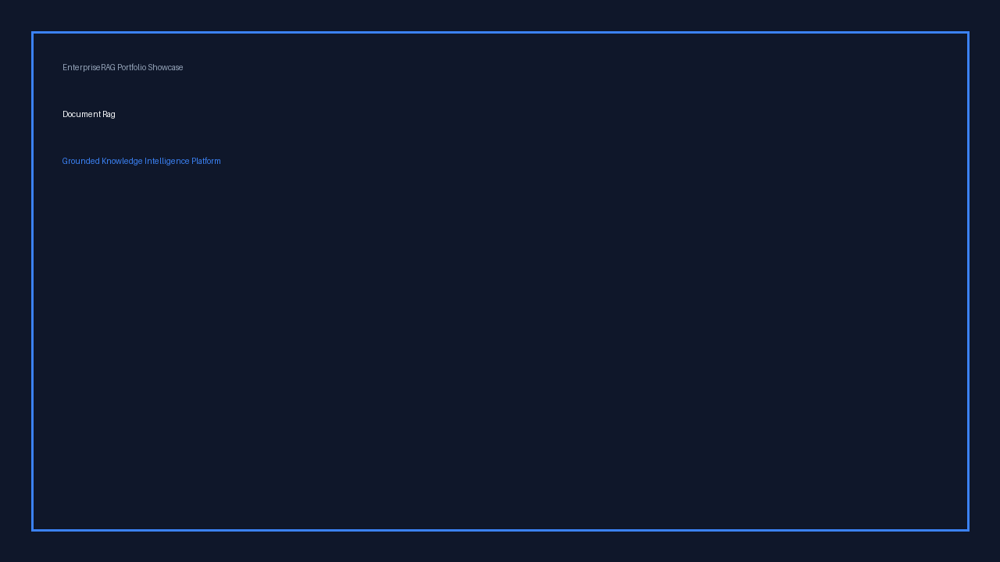

# EnterpriseRAG: Multimodal Knowledge Intelligence & Grounded AI Platform

[](https://www.python.org/)
[](https://fastapi.tiangolo.com/)
[](https://react.dev/)
[](https://www.typescriptlang.org/)
[](https://www.langchain.com/)
[](https://huggingface.co/)
[](https://github.com/facebookresearch/faiss)
[](https://github.com/SYSTRAN/faster-whisper)
[](https://docs.pytest.org/)
[](https://playwright.dev/)
[](https://docs.astral.sh/ruff/)
[](https://www.docker.com/)

> **EnterpriseRAG** is an end-to-end multimodal knowledge intelligence platform for grounded question answering, deep analysis, and evidence retrieval across documents, scanned PDFs, structured tables, audio, video, and public media sources.


---

## Navigation & Architecture Links
- [Hugging Face Space Demo](https://huggingface.co/spaces/fariskishtah/enterprise-rag-platform) *(Deployable Docker Space)*
- [System Architecture](docs/architecture/overview.md) *(High-level & pipeline diagrams)*
- [Engineering Case Study](docs/case-study.md) *(Deep dive into technical design & optimizations)*
- [Demo Video Package](docs/demo-video/demo-script.md) *(2-minute recruiter video script)*
- [Evaluation System](docs/architecture/evaluation-system.md) *(Deterministic & benchmark evaluation)*
- [Hugging Face Space Deployment Guide](docs/huggingface-spaces.md) *(Single-container Docker guide)*
- [AWS Lightsail CPU Deployment](docs/aws-cpu-deployment.md) *(2 vCPU / 4 GB profile, cookies, and benchmarks)*

---

## 1. Hero

EnterpriseRAG eliminates hallucination risks by verifying every AI-generated claim against passage-level citations, providing exact page numbers, section headers, audio timestamps, and source video playback. Designed for enterprise deployment, it runs 100% locally or in containerized environments with zero dependency on paid cloud APIs (OpenAI/Anthropic).

---

## 2. Product Overview

EnterpriseRAG transforms unstructured corporate knowledge—PDFs, DOCX files, scanned contracts, financial tables, meeting recordings, lectures, and YouTube videos—into grounded intelligence. 

Key pillars:
- **Zero Hallucination Trust Model**: Grounded prompts restrict answers to provided sources.
- **Multimodal Source Support**: Text, scanned images (OCR), structured tables, audio, and video.
- **Dual RAG Engine Architecture**: Custom production hybrid engine + LangChain LCEL course-compatibility engine.
- **Multilingual Support**: First-class Arabic and English cross-lingual QA, RTL interface, and multilingual embeddings.
- **8 GB Memory Optimised**: Custom generation queue and profiles tuned for Apple Silicon Macs and CPU Spaces.

---

## 3. Why EnterpriseRAG?

Traditional RAG prototypes suffer from four major production failures:
1. **Blind Hallucinations**: Standard LLMs construct plausible answers when evidence is missing.
2. **Media Blindness**: Inability to index or search audio, video, or scanned documents.
3. **Resource Thrashing**: Unbounded parallel LLM calls stalling resource-constrained hardware (e.g. 8 GB RAM).
4. **Lack of Observability**: No empirical evaluation metrics, accuracy tracking, or user feedback pipelines.

EnterpriseRAG addresses each challenge with deterministic verification, faster-whisper video intelligence, single-call intelligence workflows, and integrated evaluation dashboards.

---

## 4. Core Capabilities

- **Document RAG**: Grounded QA over PDF, DOCX, and TXT with sentence-boundary chunking.
- **Audio & Video Intelligence**: Automatic transcription, chapter segmentation, timestamp citations, and interactive video playback.
- **Scanned PDF OCR**: Automatic low-density page detection with Tesseract OCR fallback.
- **Structured Table Extraction**: `pdfplumber`-backed table cell coordinates and table QA.
- **Deep Intelligence Workflows**: Grounded Summaries, Consolidated Document Comparisons, and Multi-Section Research Reports.
- **Action Template Library**: 15+ pre-defined templates (CV Analysis, Meeting Minutes, Quiz Generation, Contract Audit).
- **Evaluation Dashboard**: Real-time correctness, faithfulness, latency, and retrieval accuracy tracking.
- **User Feedback System**: Answer feedback upvoting, complaint reporting, and 1-click conversion to evaluation datasets.
- **Security & Authentication**: Local JWT auth, password hashing, user-isolated knowledge bases, and IDOR protection.

---

## 5. Portfolio Screenshots

| View | Preview |
| :--- | :--- |
| **Hero Dashboard** |  |
| **Document RAG & Citations** |  |
| **Compare Documents** |  |
| **Video Intelligence & Timestamps** |  |
| **Evaluation Dashboard** |  |
| **Arabic Multilingual Workspace** |  |
| **Scanned PDF OCR** |  |
| **Extracted Table Viewer** |  |
| **Action Templates Library** |  |
| **Feedback Analytics** |  |

---

## 6. Document Intelligence

EnterpriseRAG ingests documents through a multi-stage pipeline:
1. **Validation**: Checksum SHA-256 verification and mime-type enforcement.
2. **Extraction**: Structure-preserving extraction (headings, paragraphs, page numbers).
3. **OCR Fallback**: Automatic triggering when page character density is under 50 characters.
4. **Chunking**: Sentence-boundary awareness with configurable overlap (`chunk_size=800`, `chunk_overlap=120`).
5. **Hybrid Indexing**: Dense vector embedding + BM25-style lexical index.

---

## 7. Video Intelligence

Process uploaded MP4/MKV/WAV files or public YouTube URLs:
- **Transcription**: `faster-whisper` (`tiny`, `base`, or `small`; CPU `int8`, Arabic/English/auto).
- **Secure YouTube ingestion**: Optional read-only yt-dlp cookie file with safe terminal
  authentication errors and direct-upload fallback.
- **Segmentation**: Sentence-level timestamp alignment.
- **Smart Chapters**: Automatic chapter boundaries and key points.
- **Timestamp Citations**: Clicking a citation jumps directly to that timestamp in the embedded video player.

---

## 8. Custom RAG Engine (Default Production)

The default production engine uses a custom pipeline:
- **Query Rewriting**: Standalone query generation for conversational follow-ups.
- **Hybrid Retrieval**: Dense cosine similarity (0.45) + Lexical BM25 (0.30) + Reranking (0.25).
- **Claim Verification**: Deterministic sentence-level claim matching against retrieved context.
- **Concurrency Queue**: Process-wide semaphore enforcing serial LLM generation on 8 GB RAM.

---

## 9. LangChain Engine (Course-Compatibility Layer)

EnterpriseRAG includes a complete parallel engine built on **LangChain & LCEL**:
- Composed LCEL runnable chains (`QUERY_REWRITE_PROMPT | llm | PydanticOutputParser`).
- Persistent FAISS vector store indexing.
- Direct course-compatible class abstractions (`EnterpriseGenerationLLM`, `LangChainDocumentPipeline`).
- Mode switchable dynamically via configuration (`RAG_ENGINE=langchain`).

---

## 10. Arabic and Multilingual Support

First-class support for Modern Standard Arabic and cross-lingual querying:
- **Multilingual Embeddings**: Benchmarked `intfloat/multilingual-e5-small` with correct
  query/passage prefixes and explicit reindex protection.
- **RTL Interface**: Dynamic right-to-left rendering for primarily Arabic content.
- **Cross-Lingual QA**: Ask questions in Arabic against English documents or vice versa.

---

## 11. OCR and Table Extraction

- **Scanned PDF OCR**: Integrates `pytesseract` and `pdf2image` to extract scanned text smoothly.
- **Structured Tables**: Extracted with `pdfplumber`, indexed with table-aware headers, and downloadable as CSV/JSON.

---

## 12. Evaluation Dashboard

Integrated observability tracking:
- **Metrics**: Answer Correctness, Faithfulness, Citation Validity, Median & P95 Latency.
- **Engine Benchmarking**: Side-by-side performance breakdown (Custom vs. LangChain).
- **Exporting**: Export evaluation results to JSON, CSV, or Markdown reports.

---

## 13. Low-Memory Optimisation (8 GB Apple Silicon & CPU Spaces)

Optimised specifically for limited-memory environments:
- **Single-Call Compare**: Reduced Compare from 6 sequential LLM calls to 1 consolidated call (>80% latency reduction).
- **Shared Model Adapter**: Eliminates duplicate model instances in LangChain mode.
- **Generation Queue**: `asyncio.Semaphore` queue preventing OOM thrashing.
- **Deterministic Timeouts**: Route-level `asyncio.wait_for` (HTTP 504) and frontend `AbortController`.

---

## 14. Security

- **Untrusted Context Isolation**: Source passages are demarcated with `[BEGIN_UNTRUSTED_SOURCE]` tags to prevent prompt injection.
- **SSRF Protection**: Strict URL scheme and private subnet validation for public video fetching.
- **IDOR Protection**: Access control checks on user-owned knowledge bases and documents.
- **JWT Authentication**: Password hashing with `bcrypt` and secure HTTP Bearer tokens.

---

## 15. Architecture

```text
               +-------------------------------------------------------+
               |  React 19 + TypeScript Workspace (RTL / Light / Dark) |
               +-------------------------------------------------------+
                                           |
                                           v  (FastAPI REST Endpoints)
+-----------------------------------------------------------------------------------------------+
|                                      EnterpriseRAG Backend                                    |
|                                                                                               |
|  +------------------------+  +------------------------+  +---------------------------------+  |
|  |   Document Pipeline    |  |     Media Pipeline     |  |       Evaluation & Feedback     |  |
|  |  (Pdf/Docx/OCR/Tables)  |  |  (Whisper/Subtitles)   |  |   (Datasets/Metrics/Analytics)  |  |
|  +------------------------+  +------------------------+  +---------------------------------+  |
|               |                          |                                |                   |
|               +--------------------------+--------------------------------+                   |
|                                          v                                                    |
|  +-----------------------------------------------------------------------------------------+  |
|  |                       Hybrid Vector Store & Retrieval Layer                             |  |
|  |     (Relational Float32 / FAISS + MiniLM Embeddings + BM25 Lexical + Reranker)          |  |
|  +-----------------------------------------------------------------------------------------+  |
|                                          |                                                    |
|                                          v                                                    |
|  +-----------------------------------------------------------------------------------------+  |
|  |                      Generation Queue & Model Adapter Layer                             |  |
|  |      (asyncio.Semaphore Queue + Qwen2.5-0.5B / Custom Engine / LangChain LCEL)          |  |
|  +-----------------------------------------------------------------------------------------+  |
+-----------------------------------------------------------------------------------------------+
                                           |
                                           v
                       +---------------------------------------+
                       |  Local Storage / SQLite Database / HF |
                       +---------------------------------------+
```

---

## 16. Technology Stack

- **Backend**: Python 3.11+, FastAPI, SQLAlchemy, Alembic, Pydantic v2, PyPDF, pdfplumber, pytesseract.
- **AI & NLP**: Hugging Face Transformers, Sentence-Transformers, PyTorch, FAISS, LangChain, faster-whisper.
- **Frontend**: React 19, TypeScript, Vite, Lucide Icons, Vanilla CSS Design System.
- **Testing & Quality**: Pytest, Playwright E2E, Ruff, Docker.

---

## 17. Quick Start

```bash
# 1. Clone repository
git clone https://github.com/fariskishtah/enterprise-rag-platform.git
cd enterprise-rag-platform

# 2. Setup backend environment
python3 -m venv backend/.venv
backend/.venv/bin/pip install -e 'backend[dev,media]'

# 3. Setup frontend dependencies
cd frontend
npm install

# 4. Start development servers
# Terminal 1: Backend
cd ../backend
.venv/bin/uvicorn app.main:app --reload --port 8000

# Terminal 2: Frontend
cd ../frontend
npm run dev
```

Open `http://localhost:5173` to access the application.

---

## 18. Local Development

Run quality checks and tests locally:
```bash
# Run backend pytest suite
cd backend
.venv/bin/python -m pytest tests/ -v

# Run linter
.venv/bin/ruff check app/ tests/

# Run frontend build
cd ../frontend
npx tsc --noEmit && npm run build
```

---

## 19. Hugging Face Spaces Deployment

EnterpriseRAG is ready for deployment as a single-container **Hugging Face Docker Space**:

```bash
# Build Docker image locally
docker build -t enterprise-rag-space .

# Test container on port 7860
docker run -p 7860:7860 -e APP_RUNTIME_PROFILE=huggingface_demo enterprise-rag-space
```

See [docs/huggingface-spaces.md](docs/huggingface-spaces.md) for full deployment instructions.

---

## 20. Configuration

Key environment settings in `backend/.env` (or `.env.low-memory.example`):

| Variable | Default | Description |
| :--- | :--- | :--- |
| `APP_RUNTIME_PROFILE` | `balanced` | Profile: `low_memory`, `balanced`, `quality`, `aws_cpu`, or `huggingface_demo` |
| `RAG_ENGINE` | `custom` | Engine selection: `custom` or `langchain` |
| `ENTERPRISE_RAG_GENERATION_MODEL_NAME` | `Qwen/Qwen2.5-0.5B-Instruct` | Local LLM Hugging Face model ID |
| `ENTERPRISE_RAG_EMBEDDING_MODEL_NAME` | `sentence-transformers/all-MiniLM-L6-v2` | Embedding model ID |
| `ENTERPRISE_RAG_MAX_CONCURRENT_GENERATIONS` | `2` | Process semaphore concurrency limit |
| `ENTERPRISE_RAG_GENERATION_TIMEOUT_SECONDS` | `90` | Route generation timeout (seconds) |
| `ENTERPRISE_RAG_YTDLP_COOKIES_FILE` | unset | Optional readable yt-dlp cookie file; never exposed by the API |
| `ENTERPRISE_RAG_TRANSCRIPTION_LANGUAGE` | `auto` | Transcription language: `auto`, `ar`, or `en` |
| `ENTERPRISE_RAG_WARM_MODELS_ON_STARTUP` | `false` | Non-blocking optional model warm-up |

---

## 21. Testing

EnterpriseRAG maintains comprehensive test coverage:
- **Backend Tests**: 65+ unit, integration, and low-memory performance tests in `backend/tests/`.
- **Frontend Build**: Strict TypeScript compilation and Vite bundling.
- **E2E Visual Tests**: Playwright automated portfolio screenshot generation.

---

## 22. Course-Technology Coverage

EnterpriseRAG implements all core AI engineering course concepts:
- Sentence Transformers & Vector Embeddings
- FAISS Vector Store Integration
- Hybrid Dense + BM25 Retrieval & Reranking
- LangChain LCEL & Pydantic Output Parsers
- Hugging Face Transformers Pipeline Integration
- Audio & Video Transcription with Whisper
- Quantization & Hardware Acceleration (MPS / CUDA / CPU)

---

## 23. Project Structure

```text
EnterpriseRAG/
├── .github/                 # Issue templates, PR template, CI workflows
├── artifacts/               # Generated reports, evaluations, and portfolio screenshots
├── backend/
│   ├── app/
│   │   ├── ai/              # Provider adapters, prompting, generation queue, LangChain runtime
│   │   ├── api/             # FastAPI routes (auth, rag, intelligence, eval, feedback, demo)
│   │   ├── core/            # Config, security, errors
│   │   ├── db/              # SQLAlchemy session & database engine
│   │   ├── document_processing/ # Extraction, OCR, table processing, chunking
│   │   ├── media/           # Faster-whisper transcription & audio validation
│   │   ├── models/          # SQLAlchemy database models
│   │   ├── repositories/   # Data access repositories
│   │   ├── schemas/         # Pydantic request/response schemas
│   │   └── services/        # RAG, intelligence, eval, feedback, language services
│   └── tests/               # Pytest suite
├── docs/
│   ├── architecture/        # 15 detailed architecture documents with Mermaid diagrams
│   ├── demo-video/          # Recruiter demo video script, shot list, captions
│   ├── case-study.md        # Technical engineering case study
│   └── huggingface-spaces.md# Hugging Face Docker Space deployment guide
├── frontend/
│   ├── src/
│   │   ├── api/             # API client with AbortController timeout handling
│   │   ├── components/      # Reusable React components (AppShell, Badges, Citations)
│   │   ├── pages/           # Pages (Chat, Intelligence, Eval, Feedback, Templates, Landing)
│   │   └── types.ts         # TypeScript interface declarations
├── scripts/                 # Portfolio screenshot generation script
├── Dockerfile               # Multi-stage Docker Space deployment file
├── start-space.sh           # Entrypoint script for Hugging Face Space
└── README.md                # Root project documentation
```

---

## 24. Known Limitations

- **OCR Speed**: Scanned PDF OCR via Tesseract on CPU takes ~2–4 seconds per page.
- **LLM Context Window**: 0.5B models perform best with context under 4,000 characters.
- **CPU Transcription**: Whisper `small` model requires ~5–10s per minute of audio on CPU.

---

## 25. Roadmap

- [x] Grounded RAG with citations and verification.
- [x] Video & audio intelligence with timestamp citations.
- [x] Low-memory profile for 8 GB RAM devices.
- [x] Evaluation Dashboard & User Feedback System.
- [x] Arabic & Multilingual cross-lingual support.
- [x] Scanned PDF OCR & Structured Table Extraction.
- [x] Action Template Library.
- [x] Single-container Hugging Face Docker Space deployment.
- [ ] Multi-tenant organization workspace isolation.
- [ ] Streaming SSE generation response option.

---

## 26. Author

**Faris Kishtah**
- **GitHub**: [github.com/fariskishtah](https://github.com/fariskishtah)
- **Repository**: [github.com/fariskishtah/enterprise-rag-platform](https://github.com/fariskishtah/enterprise-rag-platform)

---

## 27. Licence

Distributed under the MIT Licence. See `LICENSE` for details.
