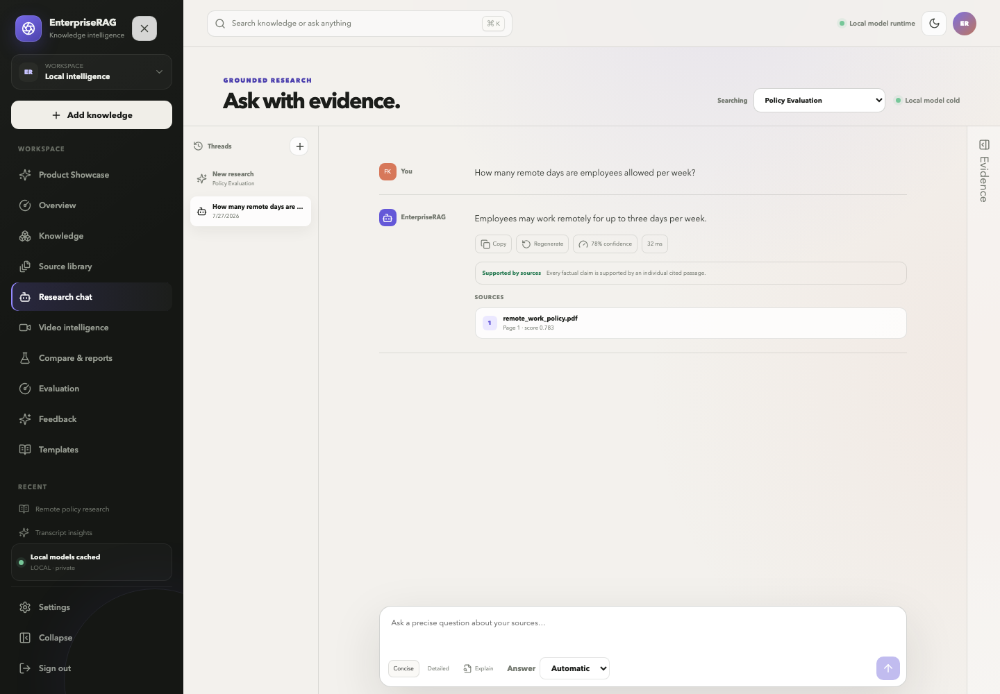
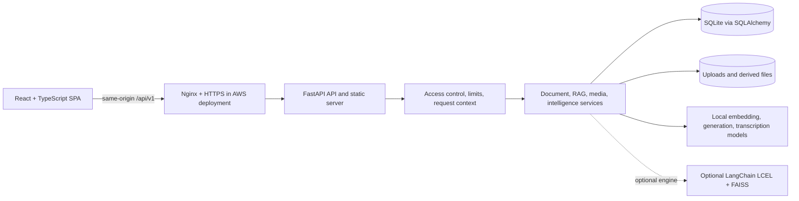
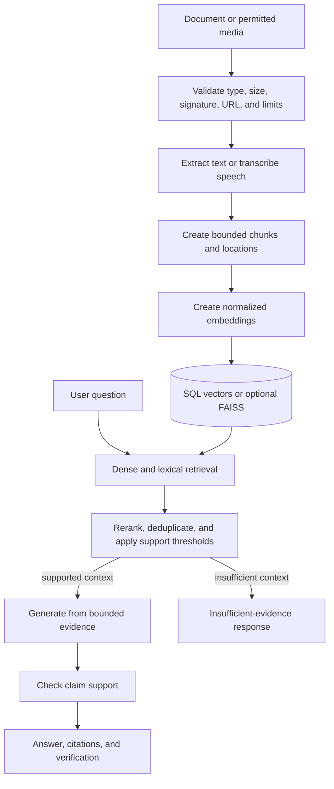

# EnterpriseRAG

> Local-first knowledge intelligence for grounded answers, document analysis, and searchable media transcripts.

EnterpriseRAG is a full-stack retrieval-augmented generation (RAG) application. It turns a bounded collection of documents, audio, and video into answers that link back to the passages, pages, sections, or timestamps used as evidence. The repository combines a React workspace, a FastAPI API, local Hugging Face models, SQLite persistence, an optional LangChain/FAISS engine, and production-oriented Docker and AWS operating scripts.

The project is designed as a small single-instance deployment and portfolio-quality engineering system, not as a multi-tenant enterprise SaaS. Its boundaries and incomplete workflows are documented explicitly below.

## Why this project exists

General-purpose chat interfaces can produce plausible answers without showing where they came from. Teams working with policies, research, contracts, study material, or meeting recordings need a narrower workflow:

1. validate and process a known set of sources;
2. retrieve only the most relevant evidence;
3. generate within a bounded context;
4. expose citations and an explicit insufficient-evidence result; and
5. retain enough operational state to test, inspect, and recover the system.

EnterpriseRAG implements that workflow locally, with no required paid model API.

## Use cases

- Ask policy or research questions and open the cited source passage.
- Summarize one document or synthesize a knowledge base.
- Compare documents for common themes, differences, and contradictions.
- Build a grounded multi-section research report and export Markdown.
- Transcribe permitted audio/video, search the transcript, and follow timestamp citations.
- Run stored RAG evaluation datasets and review aggregate results.
- Operate a constrained public demonstration with access control, quotas, cleanup, health checks, and verified backups.

## Feature highlights

- **Grounded document RAG:** PDF, DOCX, and UTF-8 TXT validation, extraction, OCR fallback, chunking, embeddings, retrieval, citations, and safe not-found behavior.
- **Media intelligence:** direct audio/video upload, ffmpeg inspection, faster-whisper transcription, transcript search, chapters, exports, and transcript-scoped Q&A.
- **Arabic and English workflows:** multilingual retrieval, configurable answer/transcription language, and right-to-left rendering for Arabic content.
- **Two RAG engines:** a default custom SQL-backed hybrid engine and an optional direct LangChain/LCEL + FAISS implementation.
- **Document intelligence:** summaries, comparisons, research reports, verification metadata, and Markdown export.
- **Evaluation and feedback backends:** stored benchmark runs, aggregate metrics, feedback analytics, and API-level conversion of feedback into evaluation cases.
- **Bounded local inference:** lazy model loading, queue limits, timeouts, runtime profiles, CPU controls, and optional supported-CUDA quantization.
- **Production packaging:** one Docker image serves the compiled React application and FastAPI API; AWS examples add Nginx, HTTPS guidance, persistent volumes, systemd timers, backup, restore, and health-gated rollback.

## Screenshot

The checked-in image below was captured from the application with demonstration data. It is a product artifact, not a performance result or proof of a currently running public deployment.



Additional reviewed and generated artifacts are available under [`artifacts/`](artifacts/). Some files in `artifacts/portfolio/` can be placeholders created by the screenshot helper and should not be treated as runtime evidence.

## Demo

Demo material in this repository lists a [Hugging Face Space](https://huggingface.co/spaces/fariskishtah/enterprise-rag-platform). Its current availability and deployed revision are external state and were not established by this repository audit, so this README does not present it as a guaranteed live service.

Never upload confidential, personal, regulated, or otherwise sensitive material to a public demonstration. AI output can be wrong; inspect the cited source text.

## Architecture



The development server omits Nginx: Vite serves the frontend and proxies `/api` to FastAPI. The production image copies the Vite build into `backend/app/static`, where FastAPI serves assets and provides the single-page-application fallback.

## Request and data flow



Document and media processing is asynchronous at the API level: the create/process endpoints return, and clients poll bounded status endpoints until the source is ready or failed.

## Technology stack

| Area | Confirmed technologies | Role |
|---|---|---|
| Frontend | React 19, TypeScript, Vite, Lucide, Vitest, Testing Library, Playwright | Browser workspace, production bundle, unit and browser tests |
| Backend | Python 3.11+, FastAPI, Pydantic, SQLAlchemy, Alembic, Uvicorn | API, validation, business services, persistence, migrations |
| AI and RAG | PyTorch, Transformers, sentence-transformers, custom hybrid retrieval/reranking | Local embeddings, generation, SQL-backed retrieval, grounded answers |
| Optional RAG engine | LangChain, langchain-core/community/Hugging Face integrations, LCEL, FAISS | Alternate direct LangChain document and structured-output pipeline |
| Documents | pypdf, pdfplumber, pdf2image, Tesseract, python-docx/docx2txt | PDF/DOCX/TXT extraction, tables, scanned-page OCR |
| Media | ffmpeg/ffprobe, faster-whisper, yt-dlp, Deno | Media validation, audio extraction, transcription, best-effort public URL import |
| Data | SQLite, local filesystem, optional persisted FAISS indexes | Relational state, embeddings, uploaded/derived files, alternate vector index |
| Delivery | Docker, Docker Compose, Nginx, systemd, GitHub Actions | Build, single-host deployment, proxying, timers, CI |

### Frontend

The frontend uses a small pathname router in [`frontend/src/App.tsx`](frontend/src/App.tsx), not React Router. Protected pages verify `/api/v1/auth/session`; the shared client uses same-origin `/api/v1` in production, attaches cookie or bearer authentication, and applies 30-second normal and 210-second intelligence request bounds.

### Backend

[`backend/app/main.py`](backend/app/main.py) builds the application, providers, storage, database session factory, middleware, route tree, heavy-operation queue, and production SPA fallback. Eleven route modules expose health, authentication, knowledge, document, RAG, intelligence, media, evaluation, feedback, templates, and demo-seed operations.

### AI and RAG

The default `custom` engine stores float32 embeddings with document chunks in SQLite and combines dense similarity, lexical coverage, heuristic reranking, duplicate suppression, and source diversity. Local Transformers generation is bounded by the selected runtime profile. The optional `langchain` engine directly uses LangChain loaders, text splitters, `HuggingFaceEmbeddings`, FAISS, prompt templates, LCEL chains, and `PydanticOutputParser`.

Course demonstrations for Hugging Face `pipeline()`, model save/reload, BitsAndBytes, PEFT/LoRA, Streamlit, and ngrok live under [`course_demo/`](course_demo/). They are not part of the deployed React/FastAPI workflow.

### Database and storage

SQLAlchemy maps 19 tables for knowledge bases, documents/chunks, conversations, users, media/transcripts, evaluation, and feedback. SQLite is the default and the AWS example persists the database and uploads under the `/data` volume. Original and derived files remain on the configured filesystem; model weights use a separate cache.

There is a known migration-history gap: a fresh `alembic upgrade head` does not create `users`, the four evaluation tables, or `user_feedback`. Normal application startup subsequently creates missing ORM tables with `Base.metadata.create_all`, so the current deployment path works, but Alembic alone is not complete schema proof. See the [database guide](docs/project-guide/05-database-guide.md) and [risk guide](docs/project-guide/09-limitations-and-risks.md).

### Deployment architecture

The tracked AWS layout is one constrained container behind host Nginx:

```text
Internet -> DNS -> HTTPS/Certbot -> Nginx -> 127.0.0.1:7860 -> FastAPI + React
                                                               -> /data
                                                               -> model cache
                                                               -> /backups
```

The Nginx file is an HTTP template with `demo.example.com`; the real hostname, DNS record, certificate, firewall, and installed systemd state are operator-owned and not verifiable from source control.

## Repository structure

```text
backend/
  app/                 FastAPI application, models, services, AI engines
  migrations/          Four Alembic revisions
  scripts/             Migration, cleanup, benchmark, backup helpers
  tests/               Deterministic and opt-in real-model tests
frontend/
  src/                 React pages, components, API client, styles, unit tests
  e2e/                 Deterministic and production Playwright suites
course_demo/            Streamlit, ngrok, notebooks, and PEFT/LoRA examples
deploy/                 Nginx and systemd templates
docs/                   Architecture, deployment, security, and project guide
scripts/                AWS deploy, backup, verification, and restore wrappers
artifacts/              Checked-in reports, evaluations, and screenshots
Dockerfile              React build plus Python/media runtime
docker-compose.aws.yml  Single-host AWS service and persistent volumes
```

For a file-by-file map, see [`docs/project-guide/03-file-map.md`](docs/project-guide/03-file-map.md).

## Local installation

### Prerequisites

- Python 3.11 or newer
- Node.js 20 (the CI- and Docker-pinned major version) and npm
- ffmpeg/ffprobe for media workflows
- Poppler and Tesseract for PDF image/OCR workflows
- Git

Model-backed workflows also require enough disk/RAM and either access to the configured Hugging Face models or an existing local cache.

### Clone and install

```bash
git clone https://github.com/fariskishtah/enterprise-rag-platform.git
cd enterprise-rag-platform

python3.11 -m venv backend/.venv
backend/.venv/bin/python -m pip install --upgrade pip
backend/.venv/bin/pip install -e 'backend[dev,media]'

npm ci --prefix frontend
```

The `media` extra adds faster-whisper. The `dev` extra adds test/lint tooling and Streamlit for the isolated course demo. Install `backend[course]` only when working on the optional course notebooks or LoRA examples.

## Backend setup

Run the backend from `backend/`; relative database, upload, model, and `.env` paths are resolved from that working directory.

```bash
cd backend
.venv/bin/alembic upgrade head
.venv/bin/uvicorn app.main:app --reload --port 8000
```

The API is then available at `http://127.0.0.1:8000`, with OpenAPI at `/docs`. Application startup creates any currently missing ORM tables after Alembic; review the migration limitation before adopting a migration-only provisioning flow.

## Frontend setup

In another terminal from the repository root:

```bash
npm run dev --prefix frontend
```

Open `http://127.0.0.1:5173`. Vite proxies `/api` to the backend on port 8000. Production builds ignore development API overrides and use relative same-origin `/api/v1`.

## Environment configuration

Local development works with code defaults and `access_mode=open`. To customize it, copy the tracked general example to the directory from which the backend runs:

```bash
cp .env.example backend/.env
```

Review every value before use. Common controls include:

```env
ENTERPRISE_RAG_ACCESS_MODE=open
ENTERPRISE_RAG_DATABASE_URL=sqlite:///./data/enterprise_rag.db
ENTERPRISE_RAG_STORAGE_PATH=data/uploads
ENTERPRISE_RAG_MODEL_CACHE_PATH=data/models
ENTERPRISE_RAG_RAG_ENGINE=custom
ENTERPRISE_RAG_MODEL_DEVICE=auto
```

Tracked profiles:

- [`.env.example`](.env.example) — general backend options;
- [`.env.low-memory.example`](.env.low-memory.example) — host development on constrained hardware;
- [`.env.aws-cpu.example`](.env.aws-cpu.example) — AWS Compose/public-demo template.

Do not commit `.env`, passwords, password hashes, session secrets, cookies, tokens, uploads, databases, backups, model caches, or TLS material. The complete setting inventory is in the [environment guide](docs/project-guide/06-environment-variables.md).

## Docker setup

Build and run the image with its self-contained `/tmp` development defaults:

```bash
docker build -t enterprise-rag:local .
docker run --rm -p 127.0.0.1:7860:7860 enterprise-rag:local
```

Open `http://127.0.0.1:7860`. This command is for disposable local validation; the default `/tmp` database, uploads, and model cache are not persistent. The low-memory environment file uses host-relative paths and is not the container persistence profile.

For a persistent AWS-style deployment, prepare an untracked root `.env` from `.env.aws-cpu.example`, supply secrets through an appropriate private process, and use `docker-compose.aws.yml`. Do not use example placeholders as production credentials.

## Running tests

### CI-equivalent deterministic checks

```bash
backend/.venv/bin/ruff check backend/app/ backend/tests/ backend/scripts/ course_demo/
backend/.venv/bin/pytest backend/tests/ -v -m "not real_models and not real_transcription"

npm ci --prefix frontend
npm run typecheck --prefix frontend
npm run build --prefix frontend
npm run test --prefix frontend
```

### Browser tests

```bash
npx --prefix frontend playwright install chromium
npm run test:e2e --prefix frontend
```

The default Playwright configuration starts a deterministic test API and Vite server. Production smoke tests can target an existing container with `PLAYWRIGHT_BASE_URL` and `PLAYWRIGHT_PRODUCTION=1`; see the [testing guide](docs/project-guide/07-testing-guide.md).

Real model tests remain available but are intentionally excluded from deterministic CI:

```bash
backend/.venv/bin/pytest backend/tests/ --collect-only -q -m real_models
backend/.venv/bin/pytest backend/tests/ --collect-only -q -m real_transcription
```

Run them only in an authorized environment with the required model cache/network, hardware, and opt-in variables. Do not weaken deterministic tests to accommodate remote model availability.

## Production deployment overview

The production example targets a small AWS CPU host and assumes one application instance.

1. Read [`docs/aws-cpu-deployment.md`](docs/aws-cpu-deployment.md) and the [deployment guide](docs/project-guide/08-deployment-guide.md).
2. Copy `.env.aws-cpu.example` to untracked root `.env` on the host and replace required placeholders privately.
3. Validate Compose and run the non-mutating preflight:

   ```bash
   docker compose -f docker-compose.aws.yml config --quiet
   scripts/deploy-aws.sh --dry-run
   ```

4. Configure persistent backup storage and, if used, keep the YouTube cookie source mounted read-only.
5. Install the reviewed Nginx/systemd templates, replace the placeholder hostname, validate Nginx, and obtain HTTPS only after DNS resolves correctly.
6. Use `scripts/deploy-aws.sh` for the authorized deployment. It creates a verified backup, builds a commit-tagged image, replaces the app, health-checks it, and can restore the previous image on failure.

An image rollback does not reverse database changes. Use a verified backup when data/schema restoration is required. This README is an overview, not authorization to deploy.

## Backup and restore

The backup workflow uses SQLite's backup API, archives application storage, records checksums and build metadata, writes a secret-free environment template, verifies the result, and applies private permissions.

```bash
scripts/backup-production.sh
scripts/verify-backup.sh /absolute/backup/root/enterprise-rag-TIMESTAMP
scripts/restore-production.sh /absolute/backup/root/enterprise-rag-TIMESTAMP --confirm
```

Restore is intentionally explicit: it verifies the selected backup, creates a pre-restore backup, stops the app, checks SQLite integrity, restores files, restarts, and health-checks. Rehearse it only on a disposable instance. The repository does not provide an off-site or encrypted backup service.

## Health and readiness

| Endpoint | Access | Meaning |
|---|---|---|
| `GET /api/v1/health` | Public | Lightweight process liveness only |
| `GET /api/v1/readiness` | Public | Database connectivity, selected schema checks, and writable storage/cache/index paths |
| `GET /api/v1/ready` | Public | Backward-compatible readiness alias |
| `GET /api/v1/operations/status` | Authenticated | Secret-free build, uptime, queue, model, storage, limit, cleanup, and backup status |

Readiness does not load remote models and its schema check does not replace full migration verification.

## Authentication and access modes

| Mode | Intended use | Boundary |
|---|---|---|
| `open` | Local development | No sign-in; do not expose publicly |
| `demo_password` | Shared public demonstration | One bcrypt-verified password and signed expiring session; all users share application data |
| `accounts` | Account login/registration integration boundary | Authentication exists, but content tables have no owner relationship and are not tenant-isolated |

Production settings validate the session secret and demo-password hash when protected access is configured. Sessions can use HttpOnly cookies; account login also returns a bearer token. The repository has no admin console or row-level multi-tenant authorization.

## Supported workflows

| Workflow | Supported inputs and behavior |
|---|---|
| Documents | PDF, DOCX, UTF-8 TXT; signature/content checks, extraction, OCR/table helpers, chunks, original/preview/chunk views, retry/delete |
| Audio | MP3, WAV, M4A; duration inspection, transcription, segments, search, intelligence, Q&A, export |
| Video | MP4, MOV, MKV, WebM; audio extraction plus the transcript workflow |
| Public media URL | Validated public URL and best-effort yt-dlp/Deno handling; platform policy, cookies, PO tokens, formats, and cloud-IP restrictions can still prevent download |
| Chat | Knowledge-base-scoped grounded answers, saved sessions, source filters, citations, language choice, debug metadata |
| Intelligence | Summary, comparison, report, verification, citations, Markdown report export |
| Evaluation | Existing dataset selection, execution, aggregate run history, Markdown export; dataset/case creation is API-only |
| Feedback | API submission/conversion and aggregate analytics page; chat rating and record-level conversion UI are not implemented |

Limits for file size, document pages, media duration, collection count, source count, concurrency, and retention are configurable. See the [feature guide](docs/project-guide/02-feature-guide.md).

## Known limitations

- SQLite, local files, in-process queues, and in-process rate limits support one small instance, not horizontal scaling.
- Accounts authenticate users but do not isolate knowledge bases or other content by owner.
- The Alembic chain does not independently reproduce six active ORM tables; normal startup currently fills them.
- Knowledge bases can be created/listed/opened but not edited or deleted through the product.
- Evaluation dataset/case creation, feedback collection/conversion, media deletion, and demo seeding have backend APIs without complete frontend flows.
- The knowledge-base workspace is a shortcut hub; it does not fetch the collection name or reject a stale ID.
- Chat does not stream tokens or cancel the server request; its stop glyph is visual and requests remain bounded by timeouts.
- YouTube/public URL ingestion is best effort. Direct permitted MP3/MP4 upload is the reliable media path.
- OCR, generation, and transcription quality depend on input quality, model files, language, and available hardware.
- Deterministic verification and evaluation metrics are heuristics, not proof of factual or semantic correctness.
- The Docker image runs as the image's default user; Compose drops Linux capabilities and enables `no-new-privileges`, but a tested non-root image remains future hardening work.
- No built-in Prometheus/OpenTelemetry stack, off-site backup provider, malware scanner, speaker diarization, or distributed job queue is present.

See the full [limitations and risks guide](docs/project-guide/09-limitations-and-risks.md).

## Security notes

Implemented controls include signed expiring sessions, bcrypt password verification, generic login failures and lockout, same-origin unsafe-cookie checks, CORS, request and upload limits, server-generated storage keys, path containment, media/document signature validation, public-URL/redirect checks, structured error envelopes, read-only secret mounts, writable private cookie copies, Nginx security-header guidance, and checksum-verified backups.

These controls are not a penetration test, privacy certification, compliance assessment, SLA, or guarantee. Do not use the shared demo for mutually untrusted tenants or sensitive data. Report vulnerabilities privately as described in [`SECURITY.md`](SECURITY.md).

## Project status

| Classification | Examples |
|---|---|
| Implemented | Document processing, custom RAG, grounded chat, citations, intelligence, media transcripts/Q&A, evaluation execution, feedback analytics, access modes, health/readiness, cleanup, backup/restore, Docker packaging |
| Requires configuration/resources | Real Hugging Face models, faster-whisper, OCR binaries, YouTube cookies/Deno/platform access, optional LangChain index, CUDA quantization, Nginx/HTTPS, host timers |
| Partial | Knowledge-base lifecycle UI, evaluation authoring UI, feedback collection UI, media delete UI, demo onboarding, chat cancellation, dynamic recent activity, accounts identity/ownership |
| Experimental/course-only | Streamlit, ngrok, PEFT/LoRA, learning notebooks, explicit model bundle save/reload |

The evidence and boundaries for each item are in the [current implementation status](docs/project-guide/10-current-status.md).

## Future improvements

Priority candidates based on the current audit:

1. add an adoption-safe migration for the six tables missing from Alembic history and extend readiness/schema tests;
2. introduce content ownership and authorization before treating `accounts` as multi-tenant;
3. complete knowledge-base lifecycle, evaluation-authoring, feedback, and media-delete UI flows;
4. move heavy processing to durable distributed jobs before scaling beyond one process;
5. add PostgreSQL/vector and object-storage architecture for multi-instance deployment;
6. implement true request cancellation/streaming and data-backed recent activity;
7. add accessibility, load, restore-drill, and deployment-specific security test programs;
8. harden the runtime with a tested non-root container and external monitoring/off-site backup controls.

## Documentation

- [Complete project guide](docs/project-guide/README.md)
- [Project overview](docs/project-guide/00-project-overview.md)
- [Page-by-page guide](docs/project-guide/01-page-by-page-guide.md)
- [Feature guide](docs/project-guide/02-feature-guide.md)
- [File map](docs/project-guide/03-file-map.md)
- [API reference](docs/project-guide/04-api-reference.md)
- [Database guide](docs/project-guide/05-database-guide.md)
- [Environment variables](docs/project-guide/06-environment-variables.md)
- [Testing guide](docs/project-guide/07-testing-guide.md)
- [Deployment guide](docs/project-guide/08-deployment-guide.md)
- [Limitations and risks](docs/project-guide/09-limitations-and-risks.md)
- [Current implementation status](docs/project-guide/10-current-status.md)
- [AWS CPU deployment runbook](docs/aws-cpu-deployment.md)
- [Security design](docs/security.md)
- [Course compatibility](docs/course-compatibility.md)
- [Contributing](CONTRIBUTING.md)

## Author and contributing

The MIT license identifies **Faris Kishtah** as the copyright holder. Contributions should follow [`CONTRIBUTING.md`](CONTRIBUTING.md) and [`CODE_OF_CONDUCT.md`](CODE_OF_CONDUCT.md). Security reports should use the private process in [`SECURITY.md`](SECURITY.md).

## License

EnterpriseRAG is licensed under the [MIT License](LICENSE).
