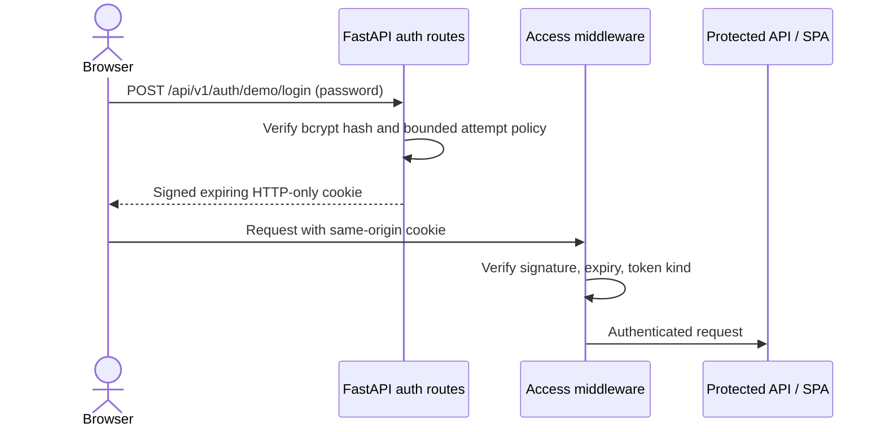

# Authentication and access boundary

EnterpriseRAG has three explicit access modes:

- `open` is the local-development default and does not require a session.
- `demo_password` is the AWS public-demo mode. One bcrypt-verified password creates a
  signed, expiring, HTTP-only session cookie.
- `accounts` retains the email/password API for development and compatibility. It creates
  signed account tokens and sets the same session cookie.

Production settings fail closed: a production/AWS environment without an explicit access
mode selects `demo_password`, and protected production modes require both a strong session
secret and, for the demo mode, a valid bcrypt password hash.

## Implemented controls

- Bcrypt password hashing and verification.
- HMAC-SHA256 signed tokens with issue/expiry timestamps and a random token identifier.
- HTTP-only, `SameSite=Lax` cookies; the AWS profile enables `Secure`.
- Same-origin checks on cookie-authenticated unsafe methods.
- Bounded per-client failed-login lockout and route rate limits.
- Generic authentication errors that do not reveal stored credentials.
- Explicit logout cookie clearing.

## Boundary and limitations

The public demo is one shared workspace behind a common password. It is not multi-tenant
SaaS, and the current data models do not provide organization- or user-level row isolation.
The in-process lockout and rate-limit state is intentionally single-instance. The controls
above reduce exposure for the documented public-demo deployment; they are not a claim of
penetration testing, compliance certification, or complete protection against abuse.
