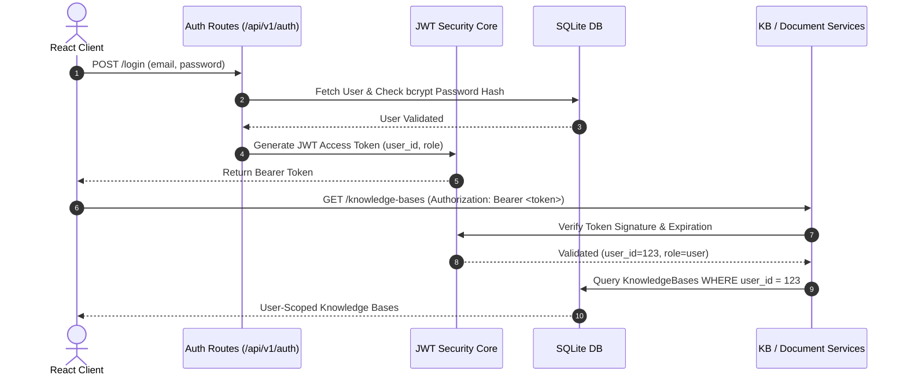

# Authentication & Authorization Architecture

EnterpriseRAG implements secure local JWT authentication with user-scoped resource ownership and role-based access control.

---

## Auth & Resource Ownership Flow

---

## Security Features
- **Password Hashing**: `passlib` with `bcrypt`.
- **Stateless Tokens**: HS256 JWT tokens with configurable expiration (`ACCESS_TOKEN_EXPIRE_MINUTES`).
- **IDOR Protection**: Access verification on every resource endpoint (Knowledge Base, Document, Chat Session, Report, Feedback).
- **Admin Role**: System health, queue monitoring, and aggregate metrics endpoint access.
