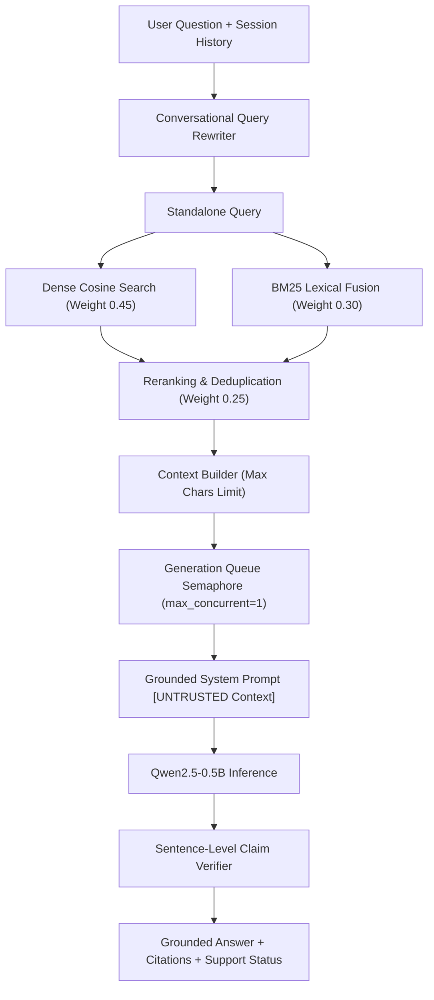

# Custom RAG Engine Architecture

The default production RAG engine in EnterpriseRAG combines hybrid retrieval, direct relevance reranking, claim verification, and process concurrency management.

---

## Custom RAG Flow Diagram

---

## Technical Highlights
1. **Query Rewriter**: Converts conversational follow-up questions ("What were its main conclusions?") into standalone search queries.
2. **Hybrid Reranking**: Merges dense vector similarity with lexical term overlap and query coverage scores.
3. **Claim Verifier**: Compares each generated sentence against source chunks to assign support statuses (`fully_supported`, `partially_supported`, `unsupported`).
