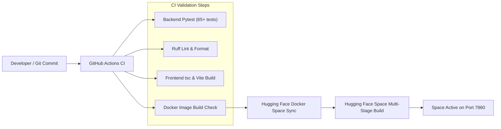

# Deployment Flow Architecture

The deployment pipeline automates static asset building, Docker container packaging, and Hugging Face Docker Space synchronization.

---

## Continuous Integration & Deployment Flow

---

## Environment Variable Checklist for Deployment
- `APP_RUNTIME_PROFILE=huggingface_demo`
- `RAG_ENGINE=custom`
- `ENTERPRISE_RAG_GENERATION_MODEL_NAME=Qwen/Qwen2.5-0.5B-Instruct`
- `ENTERPRISE_RAG_EMBEDDING_MODEL_NAME=sentence-transformers/all-MiniLM-L6-v2`
- `ENTERPRISE_RAG_MAX_CONCURRENT_GENERATIONS=1`
