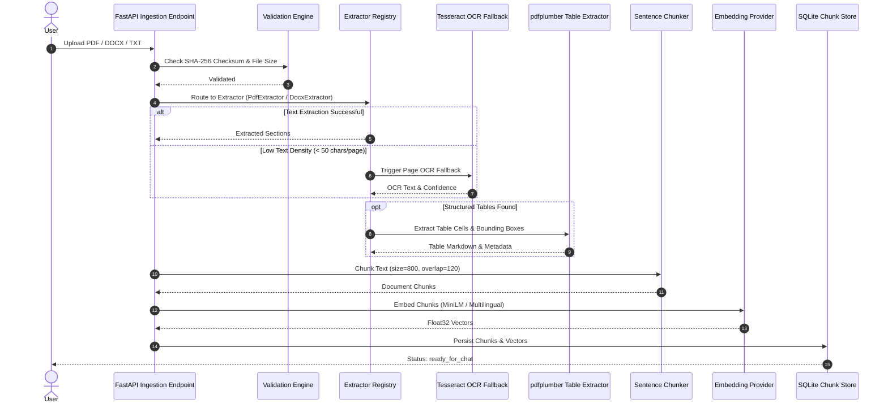

# Document Ingestion Architecture

The document ingestion pipeline processes uploaded files (PDF, DOCX, TXT) into chunked, embedded vector representations for search and retrieval.

---

## Document Ingestion Flow

---

## Key Extractor Modules

- **`PdfExtractor`**: Extracts pages using `pypdf`. Performs page-level text density check.
- **`DocxExtractor`**: Extracts paragraphs, headings, and docx tables.
- **`TxtExtractor`**: Paragraph-based UTF-8 text extraction.
- **`OcrEngine`**: Triggered automatically when pages are scanned images.
- **`TableExtractor`**: Formats grid structures into Markdown table blocks.
