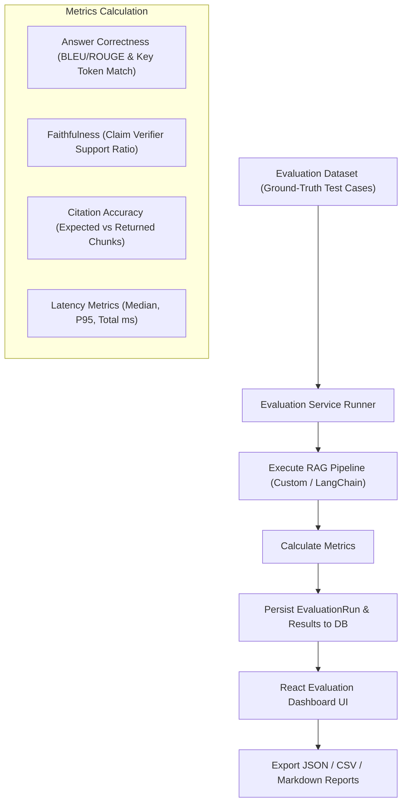

# Evaluation System Architecture

EnterpriseRAG includes an empirical evaluation pipeline to benchmark answer correctness, citation validity, faithfulness, and system latency.

---

## Evaluation Workflow

---

## Benchmark Metrics
- **Correctness**: Percentage of expected key facts present in generated answer.
- **Faithfulness**: Ratio of claims fully supported by citations.
- **Citation Accuracy**: Precision of citations relative to ground-truth passages.
- **P95 Latency**: 95th percentile response latency in milliseconds.
