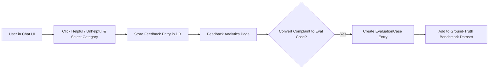

# User Feedback System Architecture

The feedback system collects user ratings on generated answers and converts low-scoring responses into evaluation benchmark test cases.

---

## Feedback-to-Evaluation Pipeline

---

## Categorized Complaint Categories
- `helpful`: Answer was accurate and well-cited.
- `incorrect`: Answer contained factual inaccuracies.
- `incomplete`: Missing key details present in source document.
- `wrong_citation`: Citation pointed to irrelevant passage.
- `too_slow`: Request exceeded acceptable response latency.
- `other`: User comment feedback.
