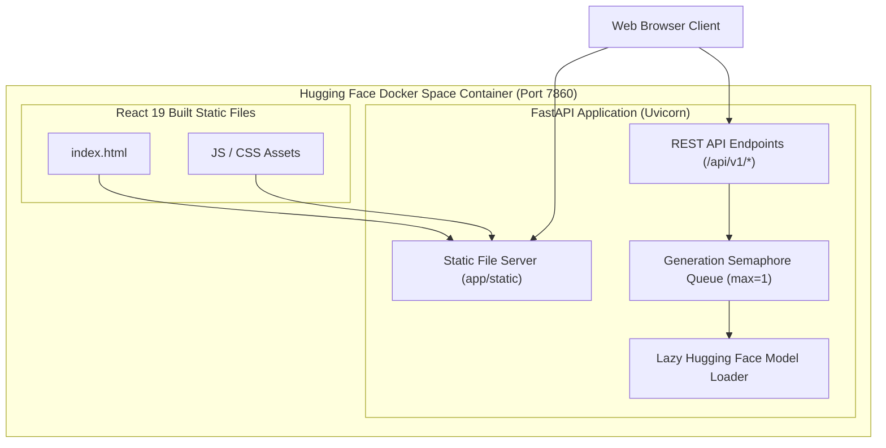

# Hugging Face Docker Space Architecture

EnterpriseRAG packages the React 19 frontend and FastAPI backend into a single-container multi-stage Docker build for seamless deployment on Hugging Face Docker Spaces.

---

## Single-Container Space Architecture

---

## Key Container Optimizations
- **Multi-Stage Build**: Stage 1 builds React static assets with Node 20; Stage 2 runs minimal Python 3.11-slim runtime.
- **Port Mapping**: Binds directly to Hugging Face standard port `7860`.
- **Demo Profile**: Automatically defaults to `APP_RUNTIME_PROFILE=huggingface_demo`.
- **Ephemeral Storage Adapter**: Handles temporary file uploads with auto-cleanup and deterministic demo workspace seeding.
