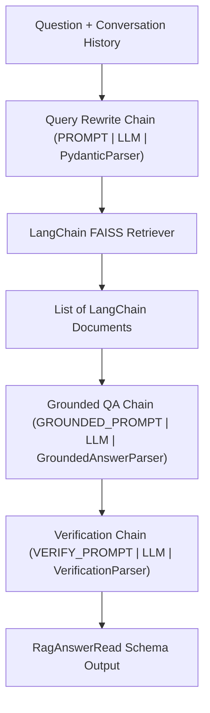
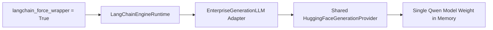

# LangChain & LCEL Course Engine Architecture

EnterpriseRAG features a fully compatible alternative engine built using **LangChain & LCEL (LangChain Expression Language)**.

---

## LCEL Orchestration Flow

---

## Low-Memory Shared Adapter Mode

When `langchain_force_wrapper=True` (default in `low_memory` profile), `LangChainEngineRuntime` instantiates `EnterpriseGenerationLLM` to wrap the existing `HuggingFaceGenerationProvider` instance instead of loading a duplicate HuggingFace pipeline.

