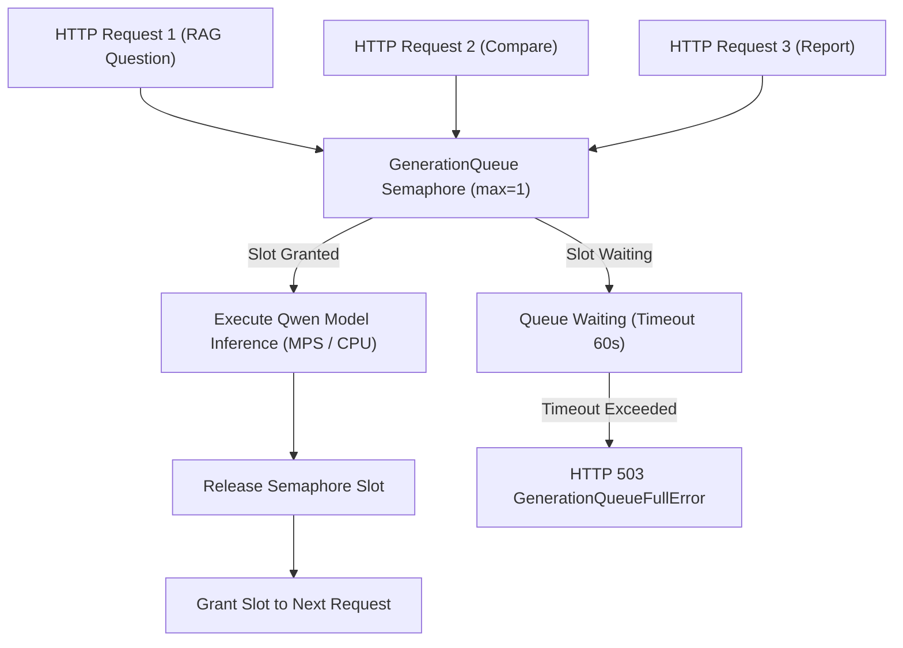

# Low-Memory Runtime Architecture

EnterpriseRAG is engineered for resource-constrained devices, including 8 GB Apple Silicon
Macs, CPU Hugging Face Spaces, and AWS Lightsail with 2 vCPU, 4 GB RAM, and swap.

---

## Concurrency Limiting Architecture

---

## Optimization Preset Profiles

| Profile | Max Concurrent Generations | Context Limit | Max Tokens | LangChain Engine Mode |
| :--- | :--- | :--- | :--- | :--- |
| **`low_memory`** | 1 (Serialized) | 4,000 chars | 128 tokens | Shared `EnterpriseGenerationLLM` |
| **`balanced`** | 2 | 12,000 chars | 256 tokens | Standard Pipeline |
| **`quality`** | 4 | 24,000 chars | 512 tokens | Full High-Precision Model |
| **`aws_cpu`** | 1 (serialized) | 3,000 chars | 96 tokens | Shared wrapper |
| **`huggingface_demo`** | 1 (serialized) | 3,000 chars | 96 tokens | Shared wrapper + demo seeding |

The AWS profile also uses deterministic generation, a 12-candidate retrieval pool, two
Torch threads, one inter-op thread, one Whisper worker, and `base` Whisper on CPU `int8`.
Embedding and generation providers use process-wide locked singleton caches so concurrent
first requests cannot load duplicate model/tokenizer instances. Query embeddings use a
bounded SHA-256-keyed cache; raw query text is not retained in cache keys.

Model warm-up is opt-in. Health checks remain independent while a background warm-up loads
embeddings first, then generation. The configuration endpoint exposes individual model and
warm-up states. See [AWS Lightsail CPU deployment](../aws-cpu-deployment.md) for measured
tradeoffs and persistent volume configuration.
