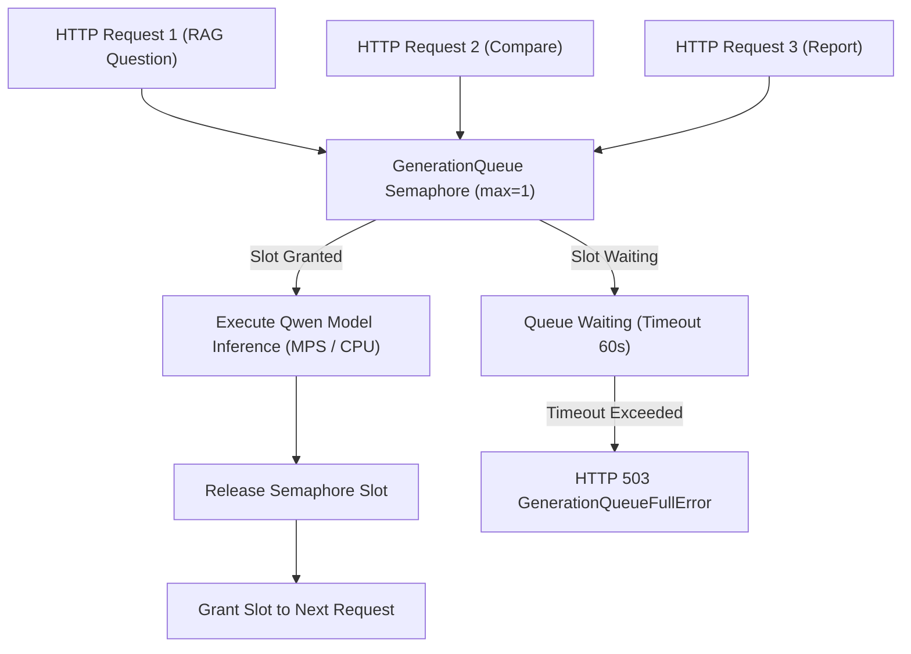

# Low-Memory Runtime Architecture

EnterpriseRAG is engineered to run reliably on resource-constrained devices, specifically Apple Silicon Macs with 8 GB unified memory and single-vCPU Hugging Face Spaces.

---

## Concurrency Limiting Architecture

---

## Optimization Preset Profiles

| Profile | Max Concurrent Generations | Context Limit | Max Tokens | LangChain Engine Mode |
| :--- | :--- | :--- | :--- | :--- |
| **`low_memory`** | 1 (Serialized) | 4,000 chars | 128 tokens | Shared `EnterpriseGenerationLLM` |
| **`balanced`** | 2 | 12,000 chars | 256 tokens | Standard Pipeline |
| **`quality`** | 4 | 24,000 chars | 512 tokens | Full High-Precision Model |
| **`huggingface_demo`** | 1 (Serialized) | 3,000 chars | 120 tokens | Shared Wrapper + Demo Seeding |
