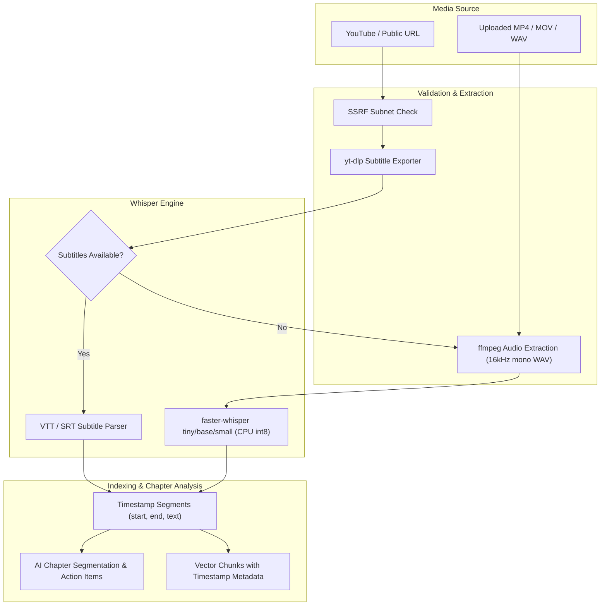

# Audio & Video Media Intelligence Architecture

EnterpriseRAG ingests local audio/video files (MP4, MOV, WAV, MP3) and public YouTube URLs, producing searchable timestamped transcripts and AI chapters.

---

## Media Processing Diagram

---

## Key Output Features
- **Interactive Player Sync**: Clicking a citation timestamp jumps video playback directly to that position.
- **Transcript Search**: Instant lexical search over full video transcripts.
- **Export Options**: Export transcripts to Markdown, TXT, or JSON formats.
- **Arabic/English Modes**: Automatic language detection is the default; `ar` and `en` can
  be forced before transcription. The task is always transcription, never implicit translation.
- **Bounded CPU Work**: VAD, beam size, worker count, and CPU threads are bounded. The AWS
  profile recommends `base`; `small` remains available for higher Arabic accuracy.
- **Optional YouTube Cookies**: The configured Netscape cookie secret remains mounted
  read-only. A serialized yt-dlp runner atomically refreshes a private mode-`600` copy under
  `/tmp`, allowing yt-dlp to update its cookie jar without mutating the secret mount. Cookie
  data and internal paths are never exposed.
- **YouTube Challenge Solving**: The production image includes Deno and yt-dlp EJS scripts.
  Missing challenge support, PO Token requirements, expired cookies, and unavailable media
  formats become safe terminal errors with direct upload as the fallback.
