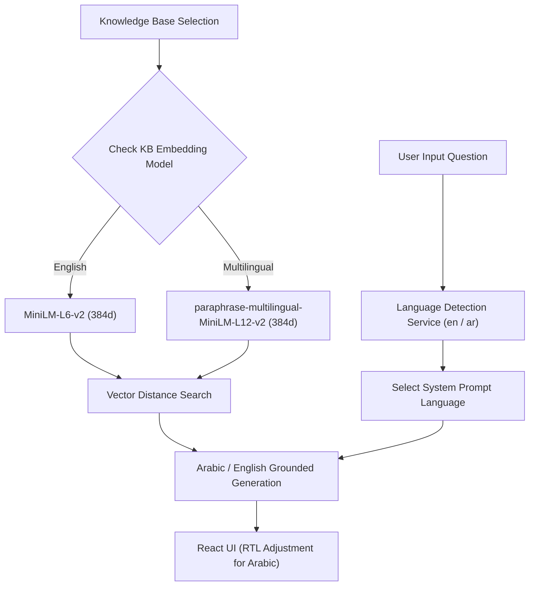

# Multilingual System Architecture

EnterpriseRAG supports cross-lingual querying, Arabic document ingestion, RTL layout rendering, and multilingual vector search.

---

## Multilingual Query & Ingestion Flow

---

## Technical Considerations
- **No Vector Mixing**: Knowledge bases enforce a single embedding model at creation time (`all-MiniLM-L6-v2` or `paraphrase-multilingual-MiniLM-L12-v2`).
- **Modern Standard Arabic Prompts**: Structured Arabic system prompts enforce grounded answer formatting and passage markers (`[SOURCE:chunk_id]`).
- **RTL UI Styling**: Frontend dynamically adjusts text direction (`dir="rtl"`) when Arabic mode is active.
