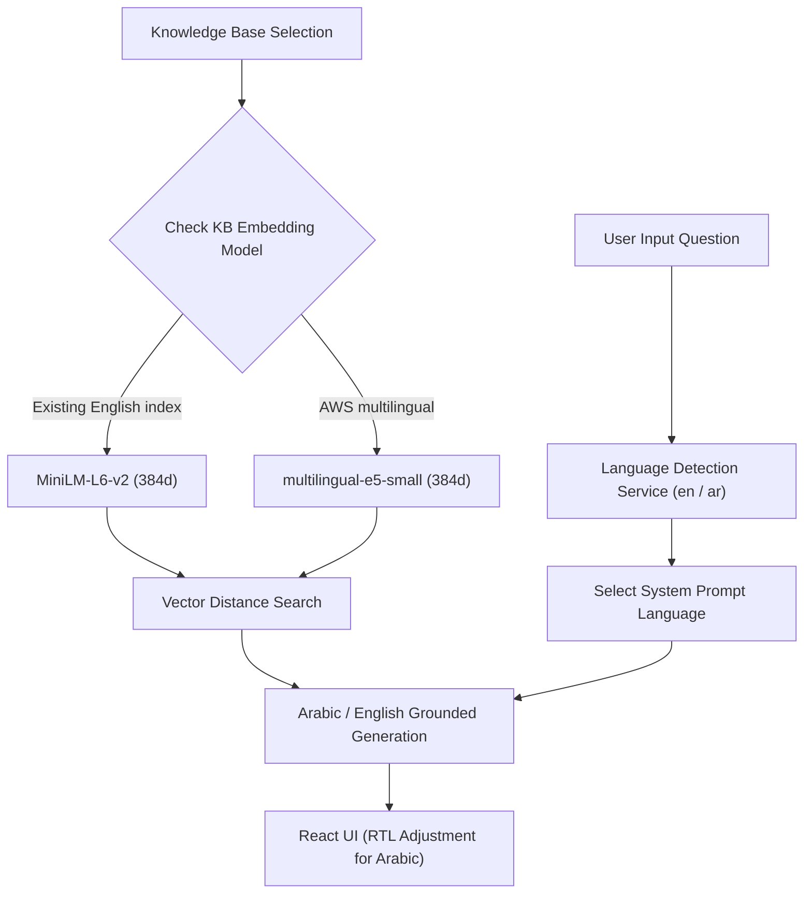

# Multilingual System Architecture

EnterpriseRAG supports cross-lingual querying, Arabic document ingestion, RTL layout rendering, and multilingual vector search.

---

## Multilingual Query & Ingestion Flow

---

## Technical Considerations
- **No Vector Mixing**: Each indexed chunk records its embedding model. Retrieval fails with
  an explicit reindex requirement when the configured model differs.
- **E5 Prefixes**: `multilingual-e5-small` receives `query:` for queries and `passage:` for
  document/media chunks in both the custom and LangChain engines.
- **Language Selection**: Automatic detection answers Arabic questions in Arabic and English
  questions in English; users can override output with Arabic or English.
- **Grounded Prompts**: Prompts preserve names, dates, numbers, and citations, and return a
  localized not-found response when evidence is insufficient.
- **RTL UI Styling**: The frontend applies `dir="rtl"` only to primarily Arabic content,
  preserving readability for mixed Arabic/English answers.
