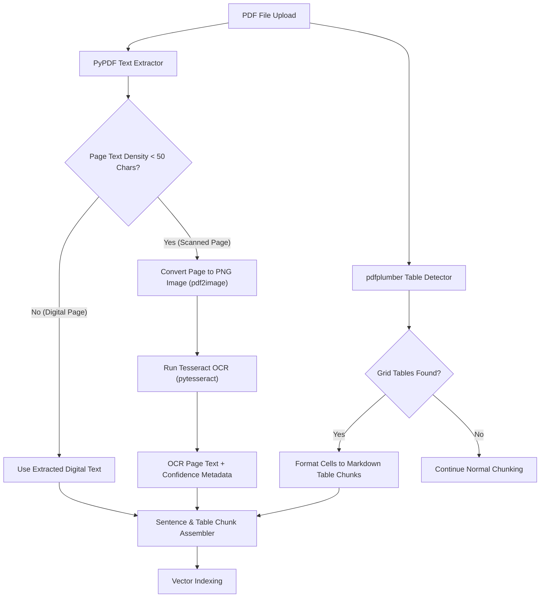

# OCR & Table Extraction Architecture

EnterpriseRAG handles scanned PDF documents via Tesseract OCR fallback and parses structured tables via `pdfplumber`.

---

## OCR Fallback & Table Extraction Flow Diagram

---

## Technical Metadata
- **OCR Engine**: Tesseract OCR (`pytesseract`).
- **Image Conversion**: `pdf2image` with poppler rendering.
- **Table Extractor**: `pdfplumber` bounding-box grid detection.
- **Table Metadata**: Chunks generated from tables store `table_id`, `row_count`, `col_count`, and `headers`.
