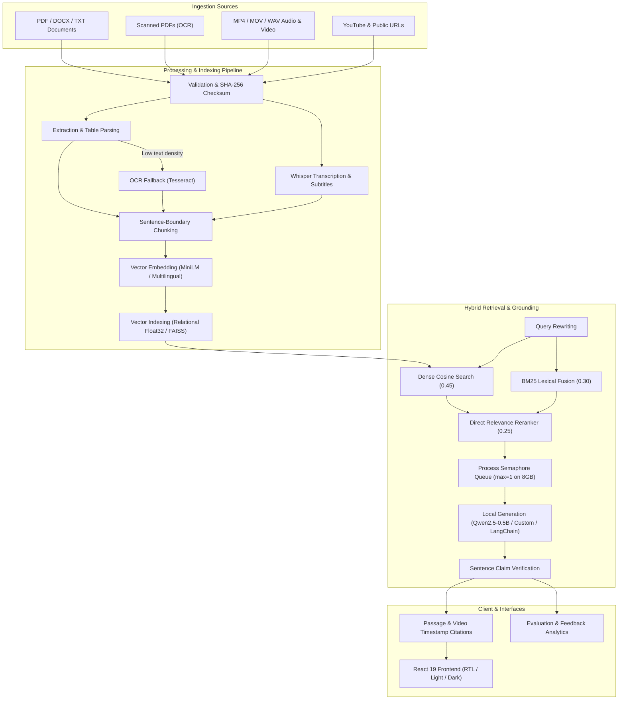

# EnterpriseRAG System Architecture Overview

EnterpriseRAG is an end-to-end multimodal AI platform designed for local-first, evidence-aware knowledge intelligence across documents, media, and public web sources. Retrieval, citations, and claim-support checks reduce unsupported output but do not guarantee correctness.

---

## High-Level Architecture Diagram

---

## Core Component Summary

| Layer | Technology | Primary Function |
| :--- | :--- | :--- |
| **API Layer** | FastAPI 0.115 / Pydantic v2 | REST API, async route handling, timeout middleware |
| **Document Processing** | PyPDF, pdfplumber, pytesseract, docx | Multi-format document, OCR, and table extraction |
| **Media Processing** | faster-whisper, ffmpeg, yt-dlp | Video transcription, audio extraction, timestamp alignment |
| **Embeddings** | Sentence-Transformers | 384d MiniLM / Multilingual vector embedding generation |
| **Vector Storage** | SQLite Float32 Chunks / FAISS | Local persistent vector storage and cosine distance search |
| **Generative LLM** | Qwen2.5-0.5B-Instruct / FLAN-T5 | Local grounded answer, summary, compare, report generation |
| **Frontend UI** | React 19 + TypeScript | Dynamic interactive workspace, citations, RTL, Light/Dark theme |
