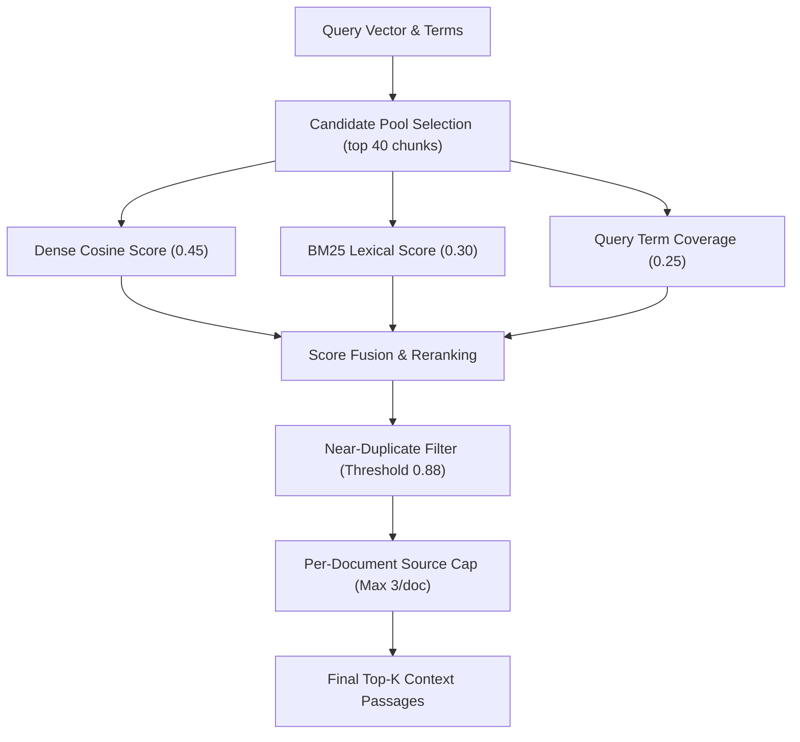

# Retrieval & Reranking Architecture

EnterpriseRAG employs a multi-stage hybrid retrieval strategy to maximize recall while maintaining high precision.

---

## Retrieval & Reranking Pipeline

---

## Score Formula

$$\text{Final Score} = (0.45 \times \text{Dense Score}) + (0.30 \times \text{Lexical Score}) + (0.25 \times \text{Query Coverage})$$

Chunks scoring below `similarity_threshold` (default 0.2) are pruned before context assembly.
