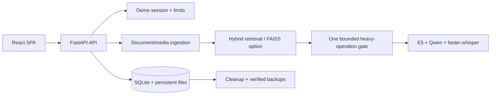

# EnterpriseRAG public-demo case study

## Problem

Teams need to ask questions across policy documents, scanned PDFs, tables, recordings, and
video without losing the source evidence. A portfolio prototype also has to behave honestly
on a 2 vCPU / 4 GB CPU host: generation is slow, media imports can fail, users can submit
hostile files, and a public demo cannot leave data indefinitely.

## Solution

EnterpriseRAG combines a React/TypeScript research workspace with FastAPI, SQLAlchemy,
SQLite, local Hugging Face models, hybrid retrieval, citation support, faster-whisper media
transcription, and an optional LangChain/LCEL engine. The public-release layer adds signed
demo sessions, quotas, a bounded cross-workflow AI gate, cleanup, verified backups,
operational endpoints, and a localhost-only Nginx/HTTPS deployment boundary.

## Architecture

The same production origin serves the SPA and `/api/v1`; the frontend does not embed a
production API hostname. Nginx proxies to Docker on `127.0.0.1:7860`, while SQLite/uploads
and Hugging Face caches use separate persistent volumes.

## Engineering decisions

### Grounding and transparent failure

The custom engine combines dense retrieval, lexical scoring, and reranking. Source passages
are marked as untrusted context. A retrieval/evidence gate can return insufficient evidence
without generating a confident-looking answer. Answers expose document/page/section or
media timestamp citations. These controls reduce unsupported output; they are not described
as a guarantee against hallucination.

### Multilingual retrieval

Arabic and English require more than RTL CSS. The AWS profile uses
`intfloat/multilingual-e5-small` with its required query/passage prefixes, language-aware
prompts, Arabic punctuation behavior, and per-content direction. Changing the embedding
model requires an explicit reindex to avoid mixing incompatible vectors.

### CPU optimisation

The Lightsail target cannot overlap Qwen and Whisper safely. Generation, summaries,
comparisons, reports, warm-up, and media processing therefore share one process-level gate.
One operation runs, at most two wait, and excess work returns a terminal busy response.
Timed-out/cancelled thread work keeps its slot until the real worker exits. Qwen does not
warm at startup; faster-whisper unloads after constrained-host jobs; CPU threads are capped
at two and CUDA is not invoked.

### Public reliability and recovery

Uploads have byte, type, signature, page, duration, count, and concurrency limits. Media
URLs are subject to SSRF and redirect checks. Demo records have last-access/expiry metadata,
and path-contained cleanup skips active/protected data. Backups use SQLite's online backup
API, archive application files, omit secret values, record deployment metadata, verify
checksums and archive paths, and require a pre-restore backup plus explicit confirmation.

### YouTube as best-effort

Deno and yt-dlp EJS support are included, while a read-only host cookie secret is copied to
a private writable runtime file. Challenge, PO Token, format, and expired-cookie failures
become actionable terminal errors. AWS IP rejection remains outside application control, so
direct MP3/MP4 upload is the release acceptance path.

## Testing

The deterministic backend suite covers documents, RAG, media, Arabic behavior, auth,
lockout/expiry/logout, quotas, signatures, page/size limits, bounded queue behavior,
cancellation slot retention, Whisper unload, cleanup path safety, backup/restore integrity,
health/readiness, and secret-safe YouTube failures. Frontend unit tests cover the API client,
timeouts, terminal UI errors, citations, RTL utilities, chat, login, and settings. Production
Playwright checks direct SPA routes, navigation, same-origin API requests, loading/error
termination, Arabic RTL, legal pages, mobile layout, console errors, and failed requests.

Real Hugging Face and Whisper tests remain registered for manual execution and are excluded
from deterministic CI markers to avoid network/model downloads.

## Measured results

These committed measurements were taken on local development machines, not Lightsail, and
should not be presented as cloud guarantees:

| Measurement | Result |
| --- | ---: |
| E5 multilingual fixture top-1 | 2/3 |
| MiniLM multilingual fixture top-1 | 1/3 |
| E5 cached cold load + passages | 11.68 s |
| E5 warm query mean | 12.88 ms |
| faster-whisper base, 12.4 s Arabic fixture | 5.61 s |
| faster-whisper small, same fixture | 8.52 s |
| AWS deterministic Qwen warm English, 32 tokens | 74.40 s |
| AWS deterministic Qwen warm Arabic, 32 tokens | 65.89 s |
| AWS deterministic Qwen measured peak RSS | 617 MB |

Sources: [`aws-cpu-deployment.md`](aws-cpu-deployment.md) and committed benchmark artifacts.

## Production limitations

- The public demo is a shared, single-instance workspace, not multi-tenant SaaS.
- SQLite, in-process rate limits, and the process-local queue do not scale horizontally.
- CPU Qwen latency remains long and workloads are intentionally serial.
- Model output, citation matching, and deterministic verification can still be wrong.
- OCR and long media workloads are expensive and capped.
- YouTube availability depends on third-party behavior and cloud IP reputation.
- No penetration test, privacy guarantee, certification, independent audit, or uptime SLA is
  claimed.

## Roadmap

1. Durable job leases and distributed cancellation.
2. PostgreSQL and object storage for multi-instance operation.
3. Complete organization/user authorization if accounts mode is promoted.
4. Streaming responses and richer low-overhead metrics.
5. Maintained PO Token provider integration if YouTube becomes a required path.
